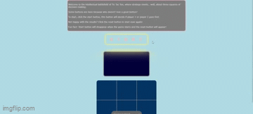

# Tic tac toe
A game found on nearly every kid's menu in the world is now available on my github! This project was really just an excuse to practice logic and deploy something on vercel.
Not sponsored by vercel, but it was very easy to set up, I really enjoy that I can push to my github and my vercel deployment will automatically update, very 
nice, 10/10. 

**Link to project:** https://tic-tac-toe-verc.vercel.app/

    

## How It's Made: 

**Tech used:** HTML, CSS, JavaScript, Vercel

Starting in the HTML and CSS, I used the body as a flex container, to give me everything in a centered column. I feel pretty clever with how I created the board for the game, in the css I used only the ids I needed
to create a single line on certain squares, I could have given each of these IDed divs a class to share so I would only have to select the class, but it was more fun my way. The buttons I found online and I changed some of 
the css to match my needs. I had fun going through someone else's code to figure out what did what and how to change things without breaking the whole set up. 
Getting into the JavaScript, I took care to try and label what I was doing as I was doing it. I noticed doing this actually made it a lot easier to get back into my work flow because I could 
trace where I was going and why I was going that way. I went the extra mile to make sure every time something on the screen was clicked, a user would get some kind of feedback which isn't as simple as you'd think. 
I also made sure to use synchronous colors. There are functions to start and reset the game, I even included a little randomizer to mix up which player gets to go first. The start and reset 
button disappear after being clicked to indicate the game needs to be started or reset. I included a value that actually can make or break the game. There is a variable called count 
that is set to equal 0. When the starts, count randomly gets added 0 or 1, if count is even, player 2 goes, if count is odd, player 1 goes. This logic helps me keep track of which player is up to move. I also included into
the logic that checks if there is a winner or a tie, to add 999999 to count, and then I set a condition that if count is over 999, the event listeners that trigger game play, won't meet the condition to activate, a wonderfully 
simple solution to a could've been tricky problem. The next interesting part is how set up the winner/tied functions. Each of the divs on the board have an ID, I then sorted all the possible ID win routes and stored them in an array. 
If all of the IDs in any of the arrays equaled either 'X' or 'O', we'd have a winner, if none of the values included a '', and there was no winner defined, the logic would know there are no more empty squares, so the game is a tie.
This checking for the winner happens after every player move.
This project is hosted on vercel, a simple way to host and send updates to a deployed projects straight from your terminal!

## Optimizations
I hadn't thought of it until I was done with the css but I could have used more variables in my css for uniform spacing between all of my content. In the JavaScript there are instances where I used let when I could have used const,
maybe that is just me being indecisive with how I think I'll use my variables. I could've also introduced count towards the top of the JS as opposed towards the bottom just to make it look better. 

## Lessons Learned

I think an underrated experience I got from working this project was going through the button code, I really enjoyed that process of messing around with someone else's code to configure it for my own needs. I got practice pushing codes in sections 
at time so each deployment is an introduction of new features and bug fixes from a previous deployment, made my work flow feel professional. When I first learned about loops I didn't see how they would be useful in production, but this project gave me a 
much needed glimpse into their helpfulness. Being able to use a forEach to add an event Listener to each div as opposed to adding one to each one manually was awesome!
